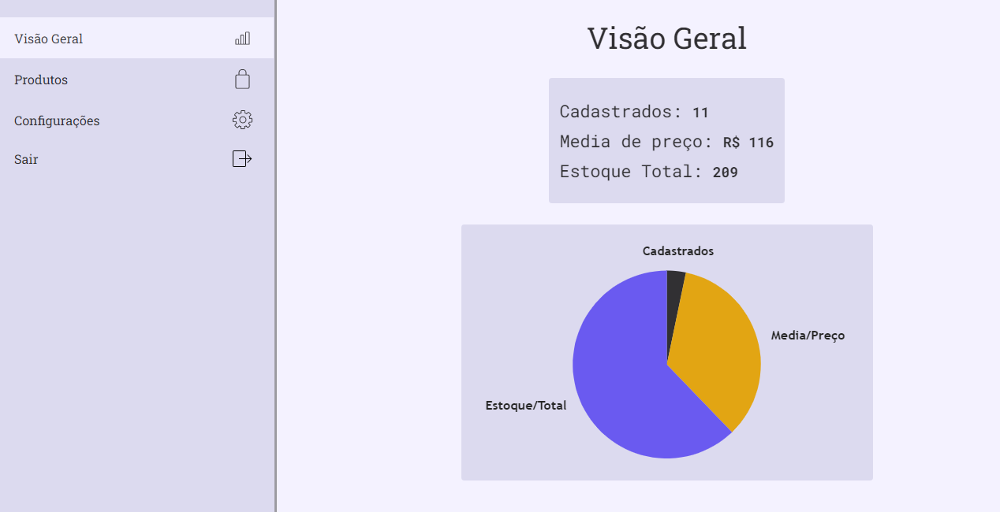
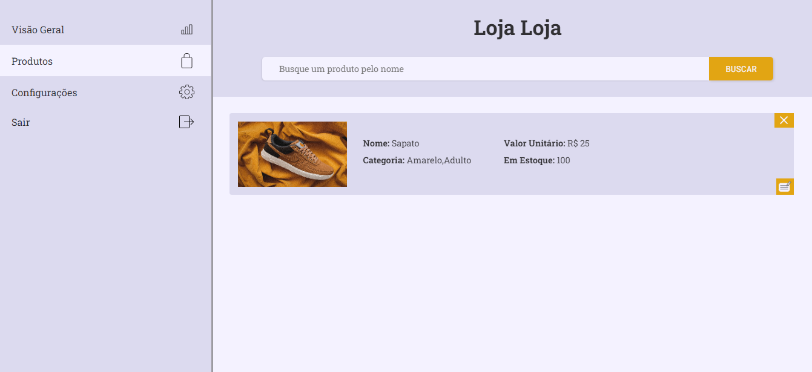
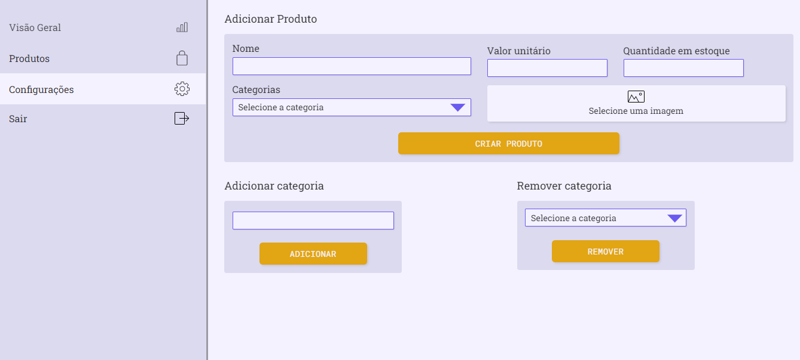

<h2 align='center'>Gestor de Loja</h2>
<h3 align='center'>
  <a href="#FrontEnd">Front-End</a> |
  <a href="#BackEnd">Back-End</a> |
  <a href="#pre-requisitos">Pré-requisitos</a> 
</h3>
<hr>

<hr>

<h2 id='FrontEnd'>Front-End</h2>

### Tecnologias
Para a construção do front end utilizei as seguintes tecnologias:
<ul> 
  <li>Javascript</li>
  <li>Typescript</li>
  <li>ReactJS</li>
  <li>Styled Components</li>
  <li>Victory - Biblioteca</li>
</ul>

### Funcionalidades

  - [X] Gerenciamento da Loja
  - [X] Criar conta
  - [X] Logar usuario
  - [X] Gráficos
  - [X] Personalize as categorias
  - [X] Crie, Remova e atualize os produtos
  - [X] Home Responsiva

<h3 align='center'>Gestor - Dados</h3>

<h3 align='center'>Gestor - Produtos</h3>

<h3 align='center'>Gestor - Configurar</h3>


<h2 id='BackEnd'>Back-End - API</h2>
Para a construção do back end utilizei as seguintes tecnologias:
<ul> 
  <li>Javascript</li>
  <li>Typescript</li>
  <li>NodeJs</li>
  <li>ExpressJS</li>
  <li>Cors - Biblioteca</li>
  <li>jsonwebtoken</li>
  <li>SQLite</li>
</ul>

### Funcionalidades

  - [X] Gerenciamento das rotas
  - [X] Criar, Atualizar e Remover do banco de dados
  - [X] Validação de dados
  - [X] JWT Token
  - [X] Response com controle de erros

A API utiliza dos métodos HTTP e assim controla os dados recebidos.

<h2 id='pre-requisitos'>Pre-requisitos</h2>

Para testar o projeto na sua maquina você irá precisar das seguintes ferramentas:
[Git](https://git-scm.com/), [Node](https://nodejs.org/en/). Além disso é ideal usar um bom editor para trabalhar com código como o [VSCode](https://code.visualstudio.com/)

```bash
#Clone este repositorio

$ git clone <https://github.com/viteydev/gestor-de-loja>

#Lembre-se de acessar a pasta do projeto

$ cd gestor-de-loja

#Para o front funcionar é necessário iniciar o back para isso faça

$ cd server

# instale as dependencias
$ npm install

# Crie o banco de dados
$ npm createDB

# incie o servidor
$ npm run dev

#O servidor irá iniciar e irá faltar iniciar o front

$ cd web

# Instale as dependencias
$ npm install

# Inicie o front
$ npm run dev

#O servidor inciará na porta:3000 - acesse <http://localhost:3000>

#Assim será possivel visualizar e utilizar de todas as funcionalidades do projeto

```

#### Feito por Vitor 👍 | Veja meu [Linkedin](https://www.linkedin.com/in/vitor-lemos-1a61b3238/)
